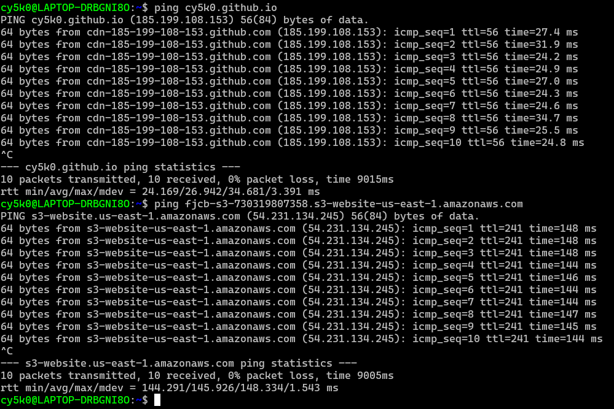

## Exámen Módulo 2
### Desafío "Viajes Chile"

Página web que contiene lo siguiente:

● Una barra de navegación fija en la parte superior de la pantalla, con el logo y links a diferentes secciones de la página, haciendo un smooth scroll.
● Un carousel que muestre las imágenes destacadas del sitio.
● Una sección de presentación, utilizando favicons y 3 párrafos (desaparece en tamaños pequeños de pantalla).
● Una sección de destacados, que muestre 4 cards (tarjetas) con la imagen e información asociada.
● Una sección de formulario de contacto.
● Una sección footer con links a las redes sociales.

En resumidas cuentas, **Viajes Chile** es un página web estática que fue desarrollada con html, CSS, JS, Bootstrap 5.3.3. También se usaron favicos de [Fontawesome](https://fontawesome.com/) y tipografías de [Google Fonts](https://fonts.google.com/).

He subido la página web a [GitHub pages](https://cy5k0.github.io/ViajesChile/) y a un [Bucket de AWS S3](http://fjcb-s3-730319807358.s3-website-us-east-1.amazonaws.com/), al parcer encontré una diferencia con la forma de dar las rutas de los assets e imágenes, s3 soporta distintos tipos de formato no asi github pages ejemplo: github pages **no** tolera lo siguiente `/assets/loquesea` no asi en AWS S3, la solucion fue cambiando los enlaces a `./assets/loquesea`, también funcionaría `assets/loquesea` 

### EXTRA - Comparativa de Ping entre AWS North Virigina y GitHub Pages

